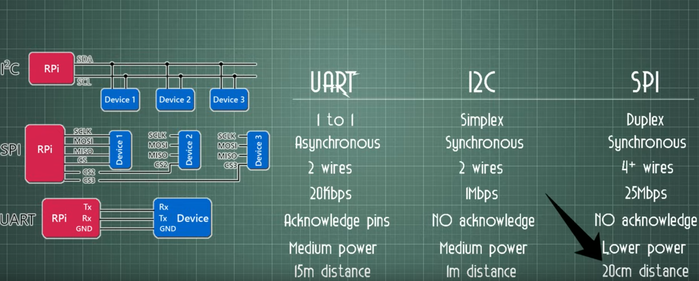
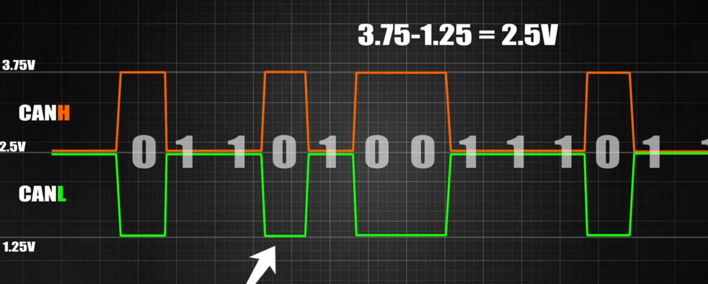
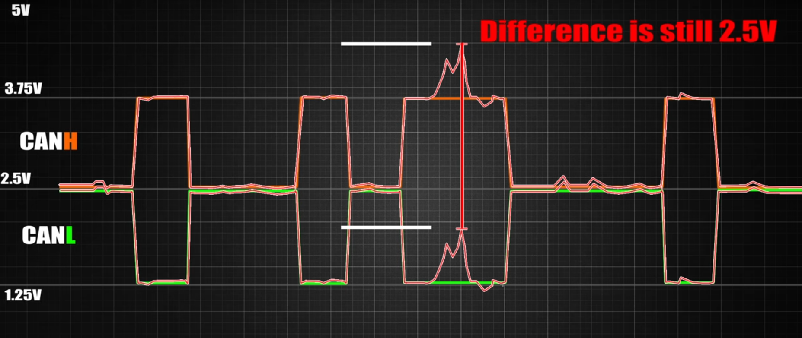

# UART

START DATA STOP   should configure baudrate / length data / start/stop /parity

Parity is a simple form of error checking, and while it's useful, more advanced error detection and correction methods (like checksums or CRC)

## I2C	

Data length / freq    as it synchronus

SDA : data

SCL :CLK

master send address first then data

slaves only respond to master request with specific address

arbitration should exist if multiple masters

* The process starts with the master initiating communication by generating a start condition.
* The master then sends its address and engages in arbitration if multiple masters are present.
* After winning arbitration, the master sends the address of the slave it wants to communicate with.
* The slave acknowledges the address, and data transmission can occur if needed.
* Communication ends with a stop condition.

# SPI

Full duplex 5 wires SCLK/MOSI/MISO/CS/GND

# CAN

Asynchronus / configure baudrate /CRC

Calculate  diff between signals 

START ID CONTROL DATA CRC EOF

Cancontroller / and Can transciever
